# Fluxograma Detalhado do Programa
## Visualizador 3D - Grau B - Expansão dos Blocos Principais

---

## 📋 Índice

1. [Fase 1: Inicialização do Sistema](#fase-1-inicialização-do-sistema)
2. [Fase 2: Loop Principal (Game Loop)](#fase-2-loop-principal-game-loop)
3. [Fase 3: Finalização](#fase-3-finalização)
4. [Fluxos Especializados](#fluxos-especializados)

---

## Fase 1: Inicialização do Sistema

### Visão Geral da Inicialização

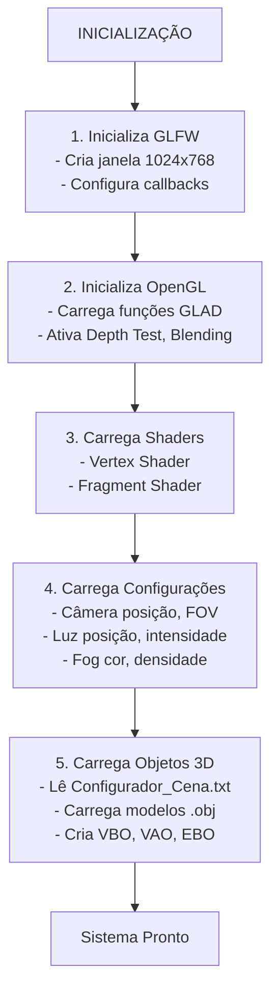

---

### 1️⃣ Inicialização GLFW (System::initializeGLFW)

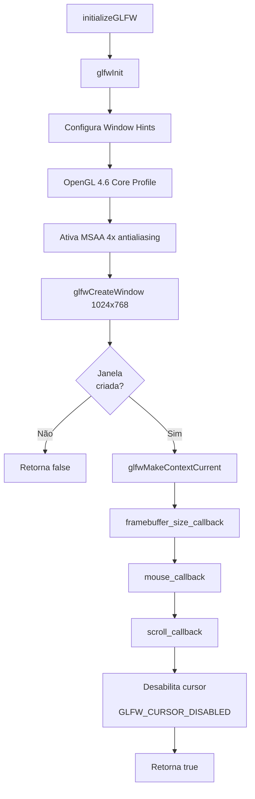

**Detalhes:**
- **glfwInit()**: Inicializa biblioteca GLFW
- **Window Hints**: Define versão OpenGL 4.6, Core Profile
- **MSAA**: Ativa antialiasing 4x para suavizar bordas
- **Callbacks**: Registra funções para eventos (resize, mouse, scroll)
- **Cursor Mode**: Captura mouse para controle de câmera FPS

---

### 2️⃣ Inicialização OpenGL (System::initializeOpenGL)

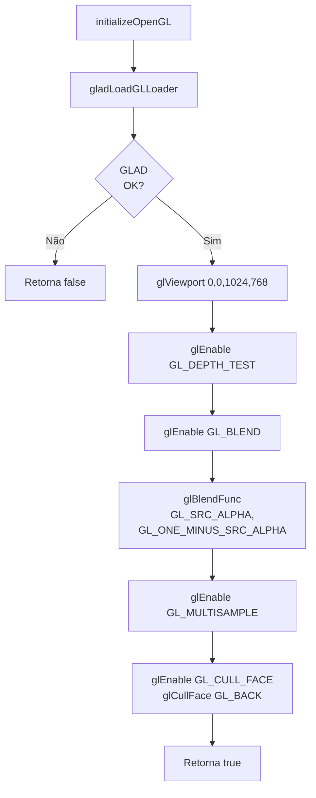

**Detalhes:**
- **GLAD**: Carrega ponteiros de funções OpenGL
- **Viewport**: Define área de renderização
- **Depth Test**: Ativa teste de profundidade (Z-buffer)
- **Blending**: Transparência com alpha blending
- **MSAA**: Ativa multisample antialiasing
- **Culling**: Remove faces traseiras (otimização)

---

### 3️⃣ Carregamento de Shaders (System::loadShaders)

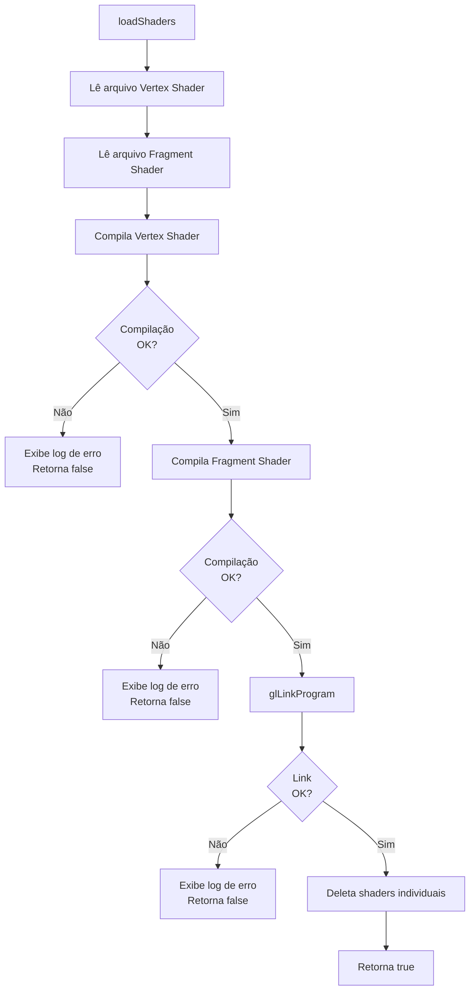

**Shaders do Sistema:**
- **Vertex Shader**: Transforma vértices (Model-View-Projection)
- **Fragment Shader**: Calcula cor final com Phong + Fog

---

### 4️⃣ Carregamento de Configurações (System::loadSystemConfiguration)

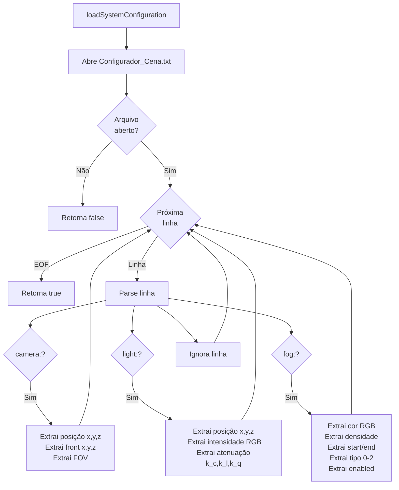

**Formato do Arquivo:**
```
camera: pos(0,2,20) front(0,0,-1) fov(45)
light: pos(0,10,5) intensity(1,1,1) att(1,0.045,0.0075)
fog: color(0.9,0.9,0.9) density(0.05) range(10,50) type(1) enabled(true)
```

---

### 5️⃣ Carregamento de Objetos 3D (System::loadSceneObjects)

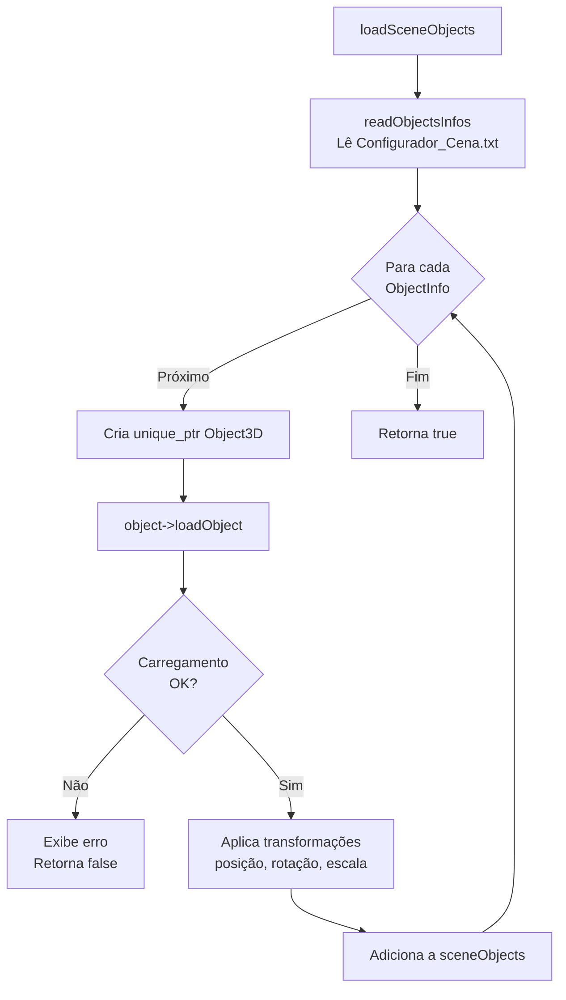

#### 5.1. Leitura do Arquivo de Configuração (readObjectsInfos)

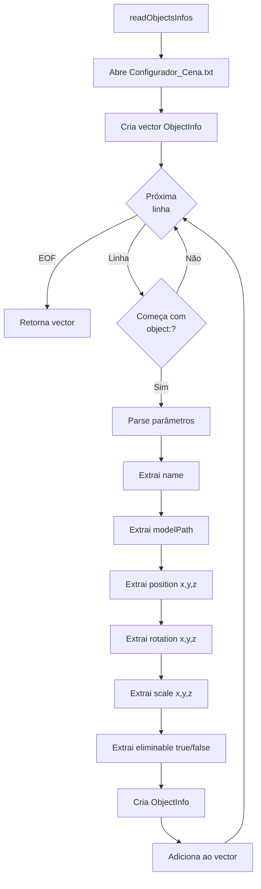

**Formato do Arquivo:**
```
object: name(Pista) model(pista.obj) pos(0,-0.5,0) rot(0,0,0) scale(1,1,1) elim(false)
object: name(Carro) model(car.obj) pos(0,0,0) rot(0,90,0) scale(1,1,1) elim(true)
```

#### 5.2. Carregamento de Modelo OBJ (Object3D::loadObject → Mesh::readObjectModel)

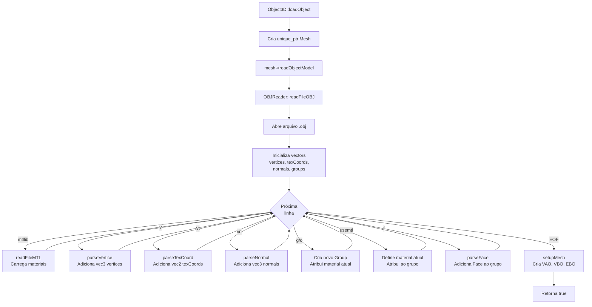

#### 5.3. Leitura de Arquivo MTL (OBJReader::readFileMTL)

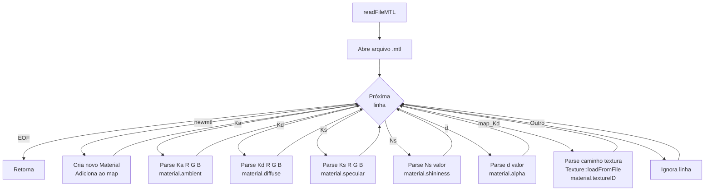

#### 5.4. Setup de Malha OpenGL (Mesh::setupMesh)

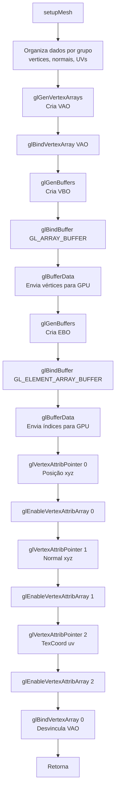

**Layout dos Atributos de Vértice:**
```
layout(location = 0) in vec3 aPos;      // Posição
layout(location = 1) in vec3 aNormal;   // Normal
layout(location = 2) in vec2 aTexCoord; // Coordenada de textura
```

---

## Fase 2: Loop Principal (Game Loop)

### Visão Geral do Loop

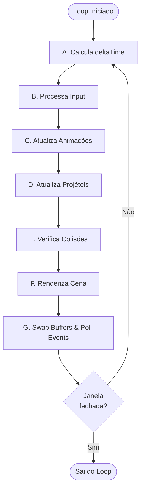

---

### A. Cálculo de DeltaTime

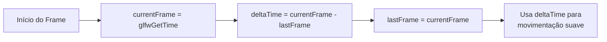

**Propósito:** Garante movimentação independente de FPS
- **60 FPS**: deltaTime ≈ 0.0167s
- **30 FPS**: deltaTime ≈ 0.0333s

---

### B. Processamento de Input (System::processInput)

```mermaid
graph TB
    Start[processInput] --> ESC{ESC<br/> pressionado?}
    ESC -->|Sim| Close[glfwSetWindowShouldClose true]
    ESC -->|Não| W
    
    Close --> W
    
    W{W ou UP<br/> pressionado?} -->|Sim| MoveF[camera.ProcessKeyboard FORWARD]
    W -->|Não| S
    MoveF --> S
    
    S{S ou DOWN<br/> pressionado?} -->|Sim| MoveB[camera.ProcessKeyboard BACKWARD]
    S -->|Não| A
    MoveB --> A
    
    A{A ou LEFT<br/> pressionado?} -->|Sim| MoveL[camera.ProcessKeyboard LEFT]
    A -->|Não| D
    MoveL --> D
    
    D{D ou RIGHT<br/> pressionado?} -->|Sim| MoveR[camera.ProcessKeyboard RIGHT]
    D -->|Não| Space
    MoveR --> Space
    
    Space{SPACE<br/> pressionado?} -->|Sim| CheckShot{Tiro não<br/> disparado?}
    Space -->|Não| F
    CheckShot -->|Sim| Shoot[disparo<br/> tiroDisparado = true]
    CheckShot -->|Não| F
    Shoot --> F
    
    F{F<br/> pressionado?} -->|Sim| CheckToggle{fogToggle não<br/> pressionado?}
    F -->|Não| Released
    CheckToggle -->|Sim| Toggle[fogEnabled = !fogEnabled<br/> fogTogglePressed = true]
    CheckToggle -->|Não| Released
    Toggle --> Released
    
    Released{F<br/> liberado?} -->|Sim| Reset[fogTogglePressed = false]
    Released -->|Não| End
    Reset --> End[Fim]
```

**Callbacks de Mouse:**

#### Mouse Movement (mouse_callback)

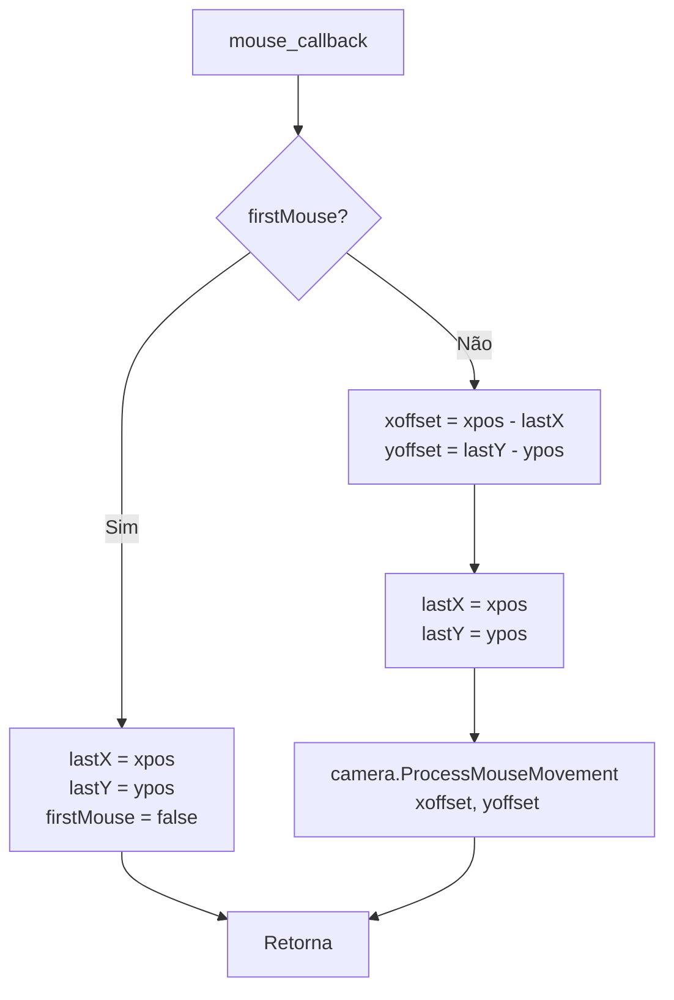

#### Scroll (scroll_callback)

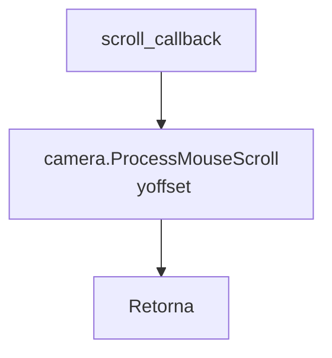

---

### C. Atualização de Animações (System::updateAnimations)

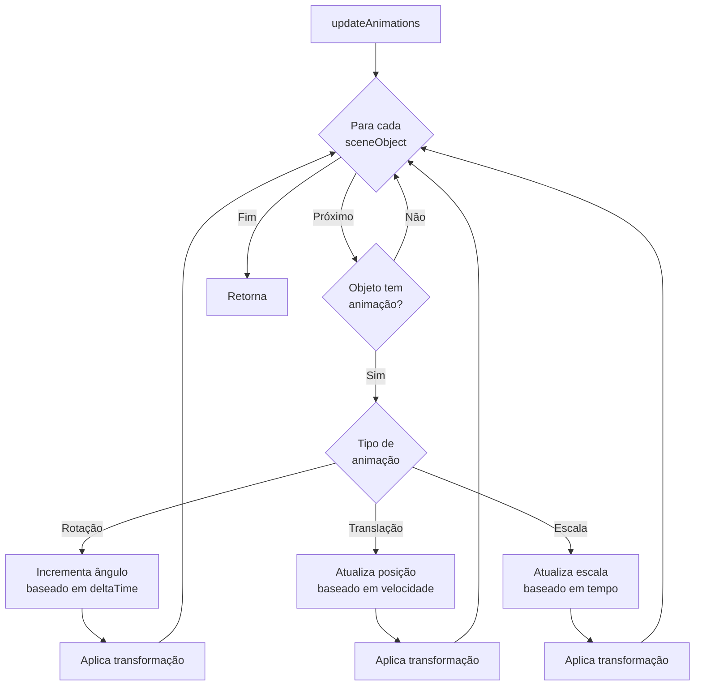

---

### D. Atualização de Projéteis (System::updateProjeteis)

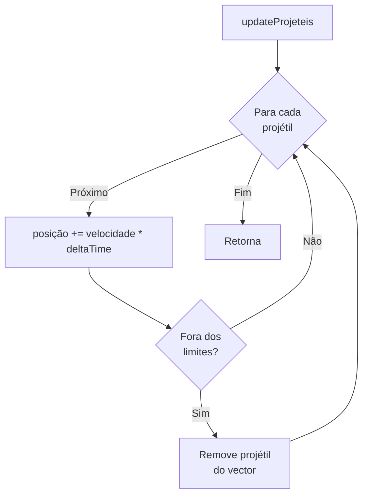

**Limites de Verificação:**
- Distância máxima da origem (ex: 100 unidades)
- Tempo de vida máximo (ex: 5 segundos)

---

### E. Verificação de Colisões (System::checkCollisions)

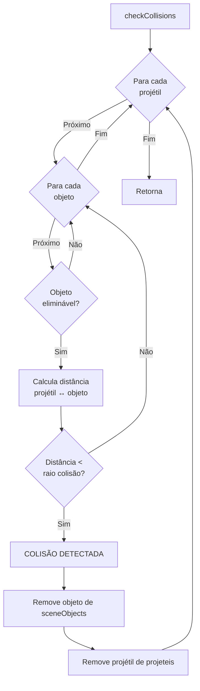

**Detecção de Colisão:**
- Tipo: Esfera-Esfera (bounding sphere)
- Fórmula: $|P_{proj} - P_{obj}| < (R_{proj} + R_{obj})$

---

### F. Renderização da Cena (System::render)

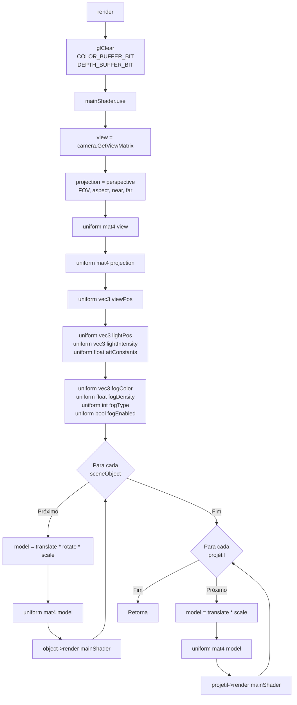

#### F.1. Renderização de Objeto Individual (Object3D::render)

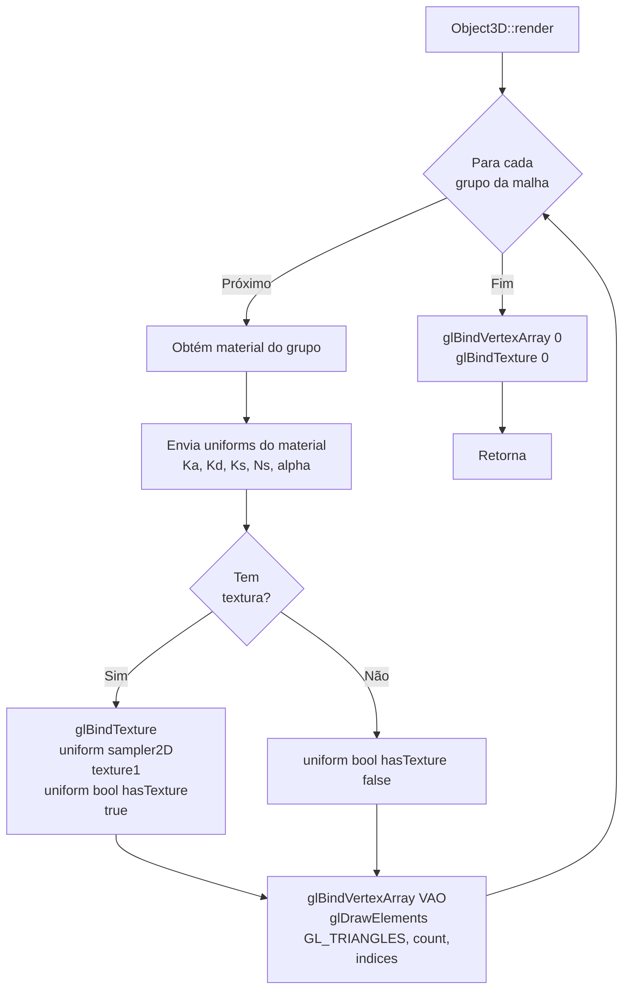

---

### G. Swap Buffers & Poll Events

```mermaid
graph TB
    Start[Fim do Frame] --> Swap[glfwSwapBuffers<br/> Exibe frame renderizado]
    Swap --> Poll[glfwPollEvents<br/> Processa eventos pendentes]
    Poll --> Return[Retorna ao início do loop]
```

**Double Buffering:**
- **Front Buffer**: Exibido na tela
- **Back Buffer**: Sendo renderizado
- Troca evita flickering (tremor visual)

---

## Fase 3: Finalização

### System::shutdown

```mermaid
graph TB
    Start[shutdown] --> ClearObj[sceneObjects.clear<br/> Chama destrutores Object3D]
    ClearObj --> ClearProj[projeteis.clear<br/> Chama destrutores Projetil]
    ClearProj --> ClearTex[Texture::clearCache<br/> glDeleteTextures]
    ClearTex --> CheckWin{window<br/> != nullptr?}
    CheckWin -->|Sim| DestroyWin[glfwDestroyWindow]
    CheckWin -->|Não| Terminate
    DestroyWin --> SetNull[window = nullptr]
    SetNull --> Terminate[glfwTerminate]
    Terminate --> Log[cout mensagem de encerramento]
    Log --> End[Retorna]
```

### Destrutor Object3D::~Object3D

```mermaid
graph TB
    Start[~Object3D] --> CheckMesh{mesh<br/> != nullptr?}
    CheckMesh -->|Sim| DestroyMesh[~Mesh<br/> Deleta VAO, VBO, EBO]
    CheckMesh -->|Não| End
    DestroyMesh --> End[Retorna]
```

### Destrutor Mesh::~Mesh

```mermaid
graph TB
    Start[~Mesh] --> CheckVAO{VAO != 0?}
    CheckVAO -->|Sim| DeleteVAO[glDeleteVertexArrays VAO]
    CheckVAO -->|Não| CheckVBO
    DeleteVAO --> CheckVBO{VBO != 0?}
    CheckVBO -->|Sim| DeleteVBO[glDeleteBuffers VBO]
    CheckVBO -->|Não| CheckEBO
    DeleteVBO --> CheckEBO{EBO != 0?}
    CheckEBO -->|Sim| DeleteEBO[glDeleteBuffers EBO]
    CheckEBO -->|Não| End
    DeleteEBO --> End[Retorna]
```

---

## Fluxos Especializados

### Disparo de Projétil (System::disparo)

```mermaid
graph TB
    Start[disparo] --> Create[Cria unique_ptr Projetil]
    Create --> SetPos[posição = camera.Position]
    SetPos --> SetDir[direção = camera.Front]
    SetDir --> SetVel[velocidade = direção * speed]
    SetVel --> Load[projetil->loadObject<br/> Carrega modelo .obj]
    Load --> Check{Carregamento<br/> OK?}
    Check -->|Não| Error[cout erro<br/> Retorna]
    Check -->|Sim| Add[Adiciona a projeteis vector]
    Add --> Return[Retorna]
```

---

### Carregamento de Textura (Texture::loadFromFile)

```mermaid
graph TB
    Start[loadFromFile] --> CheckCache{Textura já<br/> em cache?}
    CheckCache -->|Sim| ReturnCached[Retorna textureID do cache]
    CheckCache -->|Não| Load[stbi_load<br/> Carrega imagem]
    
    Load --> CheckLoad{Imagem<br/> carregada?}
    CheckLoad -->|Não| Error[cout erro<br/> Retorna 0]
    CheckLoad -->|Sim| GenTex[glGenTextures]
    
    GenTex --> Bind[glBindTexture GL_TEXTURE_2D]
    Bind --> TexImage[glTexImage2D<br/> Envia dados para GPU]
    TexImage --> Mipmap[glGenerateMipmap]
    
    Mipmap --> Params[glTexParameteri<br/> WRAP_S, WRAP_T<br/> MIN_FILTER, MAG_FILTER]
    Params --> Free[stbi_image_free]
    Free --> Cache[Adiciona ao cache]
    Cache --> ReturnNew[Retorna textureID]
```

**Parâmetros de Textura:**
- **Wrap**: GL_REPEAT (azulejos)
- **Filter**: GL_LINEAR_MIPMAP_LINEAR (trilinear)

---

### Pipeline de Renderização OpenGL

```mermaid
graph TB
    Start[Vértices na CPU] --> VBO[Upload para VBO GPU]
    VBO --> VS[Vertex Shader<br/> Transformação MVP]
    VS --> Clip[Clipping Frustum]
    Clip --> Raster[Rasterização<br/> Primitivas → Fragmentos]
    Raster --> FS[Fragment Shader<br/> Iluminação Phong + Fog]
    FS --> DepthTest[Depth Test<br/> Z-buffer]
    DepthTest --> BlendTest[Blend Test<br/> Alpha blending]
    BlendTest --> FB[Frame Buffer]
    FB --> Screen[Tela]
```

---

### Cálculo de Iluminação Phong (Fragment Shader)

```mermaid
graph TB
    Start[Para cada fragmento] --> Ambient[Ambiente<br/> I_a = Ka * lightIntensity]
    
    Start --> Diffuse[Difusa Lambert<br/> N · L = max dot normal, lightDir, 0<br/> I_d = Kd * lightIntensity * N·L]
    
    Start --> Specular[Especular Phong<br/> R = reflect -lightDir, normal<br/> R · V = max dot R, viewDir, 0<br/> I_s = Ks * lightIntensity * pow R·V, Ns]
    
    Ambient --> Sum[I_phong = I_a + I_d + I_s]
    Diffuse --> Sum
    Specular --> Sum
    
    Sum --> Att[Atenuação<br/> d = distance lightPos, fragPos<br/> att = 1 / k_c + k_l*d + k_q*d²]
    Att --> Mult[I_phong *= att]
    
    Mult --> CheckTex{hasTexture?}
    CheckTex -->|Sim| ApplyTex[I_final = I_phong * texture color]
    CheckTex -->|Não| NoTex[I_final = I_phong]
    
    ApplyTex --> CheckFog{fogEnabled?}
    NoTex --> CheckFog
    
    CheckFog -->|Sim| Fog[Calcula fator de fog<br/> fogFactor baseado em tipo<br/> I_final = mix I_final, fogColor, fogFactor]
    CheckFog -->|Não| Output
    
    Fog --> Output[FragColor = vec4 I_final, alpha]
    Output --> End[Retorna cor final]
```

**Tipos de Fog:**
- **Linear**: $f = \frac{end - d}{end - start}$
- **Exponencial**: $f = e^{-density \cdot d}$
- **Exponencial²**: $f = e^{-(density \cdot d)^2}$

---

## Arquitetura do Sistema

### Hierarquia de Classes

```
System
├── Camera
├── Shader
├── vector<unique_ptr<Object3D>>
│   └── Object3D
│       ├── unique_ptr<Mesh>
│       │   └── Mesh
│       │       ├── vector<Group>
│       │       │   └── Group
│       │       │       ├── vector<Face>
│       │       │       │   └── Face
│       │       │       └── Material
│       │       │           └── Texture (via ID)
│       │       ├── GLuint VAO, VBO, EBO
│       │       └── vector<vec3> vertices, normals
│       └── mat4 modelMatrix
└── vector<unique_ptr<Projetil>>
    └── Projetil : Object3D
        └── vec3 velocity
```

### Fluxo de Dados Completo

```mermaid
sequenceDiagram
    participant User
    participant GLFW
    participant System
    participant Camera
    participant Shader
    participant Object3D
    participant Mesh
    participant OpenGL
    participant GPU

    User->>GLFW: Input (teclado/mouse)
    GLFW->>System: Callbacks
    System->>Camera: ProcessInput
    Camera-->>System: Atualiza posição/direção
    
    System->>System: updateAnimations
    System->>System: updateProjeteis
    System->>System: checkCollisions
    
    System->>OpenGL: glClear
    System->>Shader: use()
    System->>Shader: setUniforms (view, proj, light, fog)
    
    loop Para cada objeto
        System->>Object3D: render(shader)
        Object3D->>Shader: setUniforms (model, material)
        Object3D->>Mesh: draw()
        Mesh->>OpenGL: glBindVertexArray(VAO)
        Mesh->>OpenGL: glDrawElements
        OpenGL->>GPU: Processa vértices
        GPU->>GPU: Vertex Shader
        GPU->>GPU: Rasterização
        GPU->>GPU: Fragment Shader
        GPU->>GPU: Testes (depth, blend)
        GPU-->>OpenGL: Frame buffer
    end
    
    System->>GLFW: glfwSwapBuffers
    GLFW->>GPU: Exibe na tela
    GPU-->>User: Imagem renderizada
```

---

## Resumo de Performance

### Otimizações Implementadas

| Técnica | Descrição | Benefício |
|---------|-----------|-----------|
| **Face Culling** | Remove faces traseiras | -50% fragmentos processados |
| **Depth Test** | Descarta fragmentos ocultos | Menos overdraw |
| **Batch por Material** | Agrupa objetos por textura | Reduz trocas de estado |
| **Cache de Texturas** | Reutiliza texturas carregadas | Economiza VRAM |
| **DeltaTime** | Movimentação independente de FPS | Consistência entre máquinas |
| **MSAA 4x** | Antialiasing por hardware | Suavização eficiente |

### Estatísticas Típicas

- **Objetos na cena**: 10-50
- **Triângulos por objeto**: 100-10,000
- **Texturas**: 5-20 (cache compartilhado)
- **FPS alvo**: 60 FPS (16.67ms/frame)
- **Resolução**: 1024x768

---

**Autores:** Ian Rossetti Boniatti e Eduardo Tropea  
**Curso:** Jogos Digitais - Unisinos  
**Disciplina:** Computação Gráfica em Tempo Real  
**Data:** Novembro 2025
