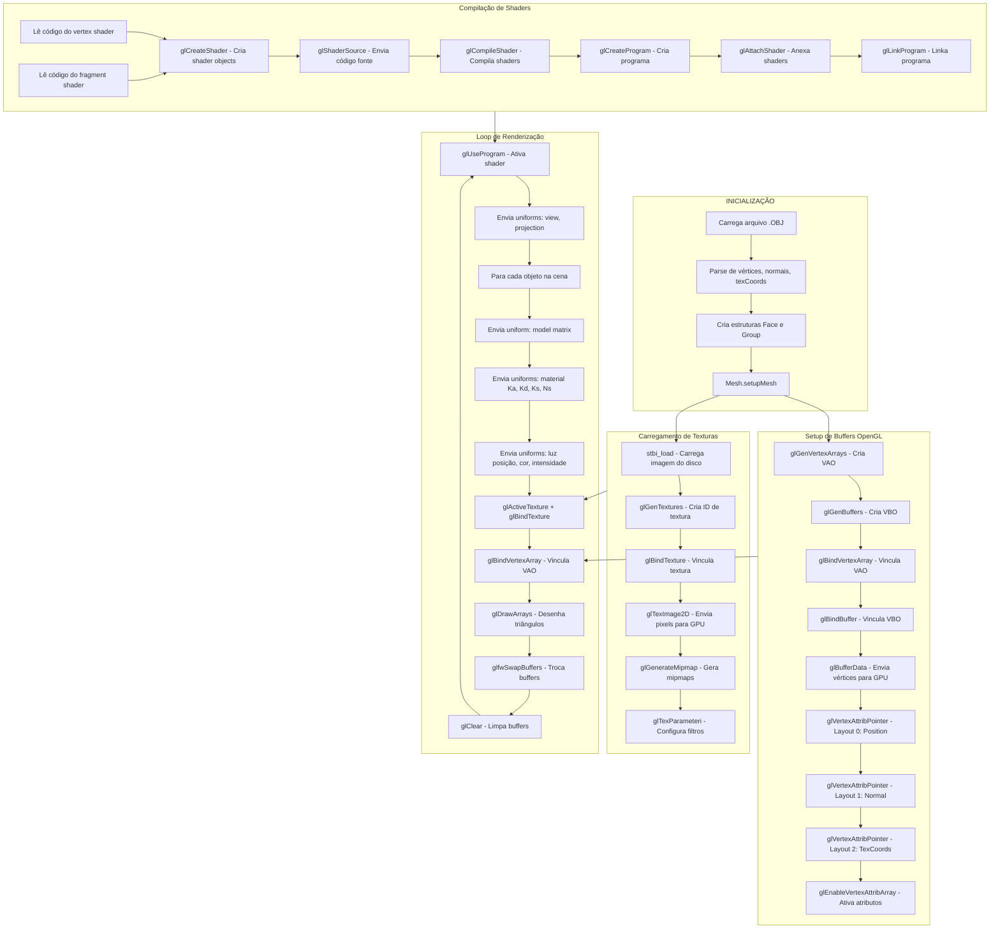
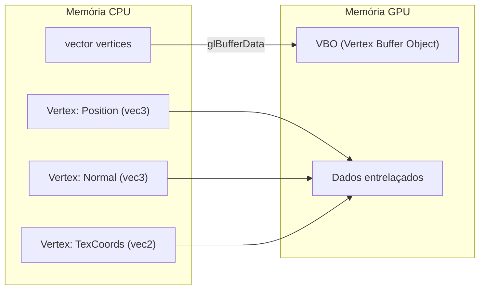
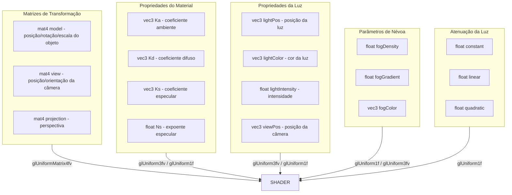

# Fluxograma: Envio de Informações para OpenGL

## Diagrama Principal



---

## Detalhamento: Dados Enviados para GPU

### 1. Vértices (VBO)



### 2. Layout de Atributos

| Location | Atributo   | Tipo  | Tamanho | Offset                        |
|----------|------------|-------|---------|-------------------------------|
| 0        | Position   | vec3  | 12 bytes| 0                             |
| 1        | Normal     | vec3  | 12 bytes| offsetof(Vertex, Normal)      |
| 2        | TexCoords  | vec2  | 8 bytes | offsetof(Vertex, TexCoords)   |

**Stride total:** `sizeof(Vertex)` = 32 bytes

### 3. Uniforms Enviados por Frame



---

## Resumo das Funções OpenGL Utilizadas

| Função                    | Propósito                                      |
|---------------------------|------------------------------------------------|
| `glGenVertexArrays`       | Cria Vertex Array Object                       |
| `glGenBuffers`            | Cria Vertex Buffer Object                      |
| `glBindVertexArray`       | Ativa VAO para uso                             |
| `glBindBuffer`            | Ativa VBO para uso                             |
| `glBufferData`            | Envia dados de vértices para GPU               |
| `glVertexAttribPointer`   | Define layout dos atributos                    |
| `glEnableVertexAttribArray`| Ativa atributo de vértice                     |
| `glGenTextures`           | Cria objeto de textura                         |
| `glBindTexture`           | Ativa textura para uso                         |
| `glTexImage2D`            | Envia pixels da textura para GPU               |
| `glTexParameteri`         | Configura filtros de textura                   |
| `glGenerateMipmap`        | Gera níveis de mipmap                          |
| `glCreateShader`          | Cria objeto de shader                          |
| `glShaderSource`          | Envia código fonte do shader                   |
| `glCompileShader`         | Compila shader                                 |
| `glCreateProgram`         | Cria programa de shader                        |
| `glAttachShader`          | Anexa shader ao programa                       |
| `glLinkProgram`           | Linka programa de shader                       |
| `glUseProgram`            | Ativa programa de shader                       |
| `glUniformMatrix4fv`      | Envia matriz 4x4 para shader                   |
| `glUniform3fv`            | Envia vetor 3D para shader                     |
| `glUniform1f`             | Envia float para shader                        |
| `glUniform1i`             | Envia inteiro para shader                      |
| `glDrawArrays`            | Renderiza primitivas                           |
| `glClear`                 | Limpa buffers de cor/profundidade              |

---

## Pipeline Completo

```
┌─────────────────────────────────────────────────────────────────────────────┐
│                              FLUXO DE DADOS                                 │
├─────────────────────────────────────────────────────────────────────────────┤
│                                                                             │
│  Arquivo .OBJ ──► Parse ──► CPU (vector<Vertex>) ──► GPU (VBO)              │
│                                                                             │
│  Arquivo .MTL ──► Parse ──► Material (Ka, Kd, Ks, Ns) ──► Uniforms          │
│                                                                             │
│  Arquivo .PNG/JPG ──► stbi_load ──► CPU (pixels) ──► GPU (Textura)          │
│                                                                             │
│  Arquivo .glsl ──► Leitura ──► glShaderSource ──► glCompileShader           │
│                                                                             │
│  Camera/Transform ──► Matrizes (model, view, proj) ──► Uniforms             │
│                                                                             │
│  Configurador_Cena.txt ──► Parâmetros (luz, fog, atenuação) ──► Uniforms    │
│                                                                             │
└─────────────────────────────────────────────────────────────────────────────┘
```
