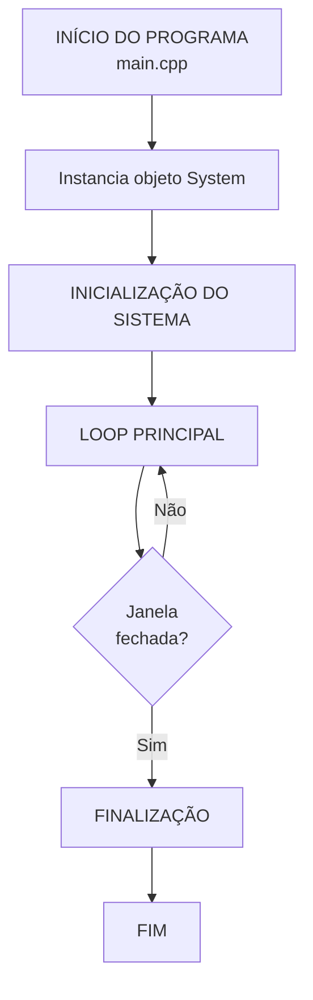

# Fluxograma Simplificado do Programa
## Visualizador 3D - Grau B

---

## Visão Geral

---

## Fluxo Completo em 3 Fases

### 1️⃣ Inicialização
Configura OpenGL, carrega recursos (shaders, texturas, modelos 3D)

### 2️⃣ Loop Principal  
Atualiza e renderiza continuamente até fechar janela

### 3️⃣ Finalização
Limpa recursos e fecha aplicação

---

## Resumo das Etapas Principais

| Fase | Etapas |
|------|--------|
| **Inicialização** | 1. GLFW → 2. OpenGL → 3. Shaders → 4. Configurações → 5. Objetos 3D |
| **Loop Principal** | A. deltaTime → B. Input → C. Animações → D. Projéteis → E. Colisões → F. Renderiza → G. Swap |
| **Finalização** | Limpa buffers → Libera texturas → Destroi shaders → Fecha janela → Termina GLFW |

---

## Tecnologias Utilizadas

- **GLFW** - Gerenciamento de janela e input
- **GLAD** - Carregamento de funções OpenGL
- **GLM** - Matemática 3D (matrizes, vetores)
- **stb_image** - Carregamento de texturas
- **OpenGL 4+** - API de renderização gráfica

---

## Características Principais

✅ Iluminação Phong (ambiente + difusa + especular)  
✅ Suporte a texturas e materiais  
✅ Sistema de câmera FPS (movimentação livre)  
✅ Sistema de projéteis com detecção de colisão  
✅ Efeito de neblina (fog) configurável  
✅ Objetos 3D carregados de arquivos .obj  
✅ Configuração de cena via arquivo texto  

---

**Autores:** Ian Rossetti Boniatti e Eduardo Tropea  
**Curso:** Jogos Digitais - Unisinos  
**Disciplina:** Computação Gráfica em Tempo Real
