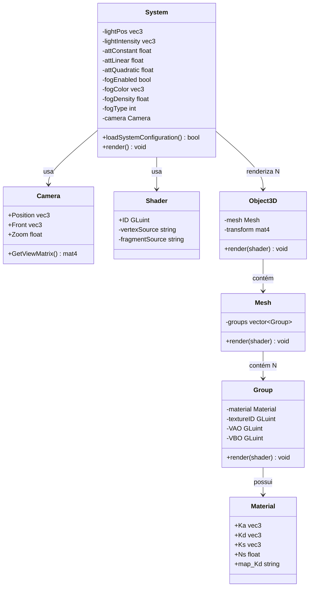
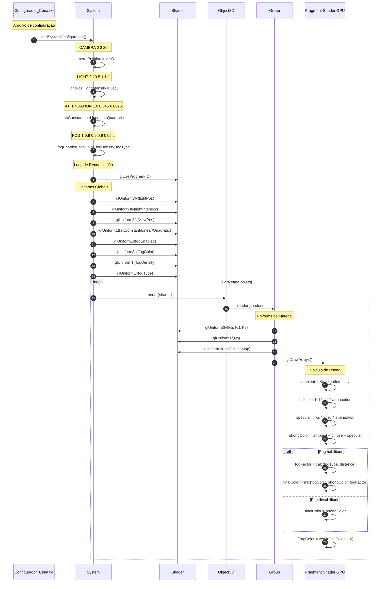
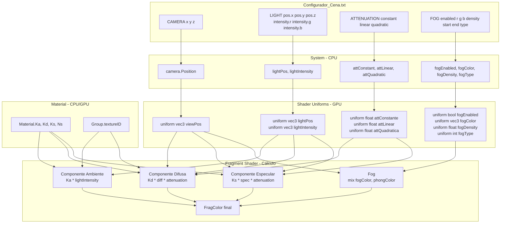

# Fluxo de Implementação do Modelo de Iluminação Phong Completo

**Configurador_Cena.txt → System → Shader → GPU** | Visualizador 3D - OpenGL 4.6

---

## Diagrama de Classes



---

## Sequência de Implementação



---

## Fluxo de Dados: Configuração → GPU



---

## Métodos Principais

| Classe | Métodos Chave |
|--------|---------------|
| **System** | `loadSystemConfiguration()` `render()` |
| **Object3D** | `render(shader)` |
| **Mesh** | `render(shader)` |
| **Group** | `render(shader)` - Envia Ka, Kd, Ks, Ns, textureID |
| **Shader** | `glUseProgram()` `glUniform*()` |

### Parâmetros do Configurador_Cena.txt

```text
CAMERA x y z
  → camera.Position = vec3(x, y, z)

LIGHT pos.x pos.y pos.z intensity.r intensity.g intensity.b
  → lightPos = vec3(pos.x, pos.y, pos.z)
  → lightIntensity = vec3(intensity.r, intensity.g, intensity.b)

ATTENUATION constant linear quadratic
  → attConstant = constant (c1 nos slides)
  → attLinear = linear (c2 nos slides)
  → attQuadratic = quadratic (c3 nos slides)
  → attenuation = 1.0 / (c1 + c2*d + c3*d²)

FOG enabled r g b density start end type
  → fogEnabled = bool(enabled)
  → fogColor = vec3(r, g, b)
  → fogDensity = density
  → fogType = type (0=linear, 1=exponencial, 2=exponencial²)
```

---

## Cálculos no Fragment Shader

### 1. Componente Ambiente

```glsl
vec3 ambient = Ka * lightIntensity * baseColor;
```

### 2. Componente Difusa

```glsl
vec3 lightDir = normalize(lightPos - elementPosition);
float diff = max(dot(norm, lightDir), 0.0);
float distance = length(lightPos - elementPosition);
float attenuation = 1.0 / (attConstante + attLinear * distance + attQuadratica * distance²);
vec3 diffuse = Kd * diff * attenuation * lightIntensity * baseColor;
```

### 3. Componente Especular

```glsl
vec3 viewDir = normalize(viewPos - elementPosition);
vec3 reflectDir = reflect(-lightDir, norm);
float spec = pow(max(dot(viewDir, reflectDir), 0.0), Ns);
vec3 specular = Ks * spec * attenuation * lightIntensity;
```

### 4. Fog

```glsl
if (fogEnabled) {
    float fogDistance = length(viewPos - elementPosition);
    float fogFactor;
    
    if (fogType == 0)      // Linear
        fogFactor = 1 / fogDistance;
    else if (fogType == 1) // Exponencial
        fogFactor = exp(-fogDensity * fogDistance);
    else if (fogType == 2) // Exponencial²
        fogFactor = exp(-pow(fogDensity * fogDistance, 2.0));
    
    fogFactor = clamp(fogFactor, 0.0, 1.0);
    finalColor = mix(fogColor, phongColor, fogFactor);
}
```

### 5. Cor Final

```glsl
vec3 phongColor = ambient + diffuse + specular;
vec3 finalColor = fogEnabled ? mix(fogColor, phongColor, fogFactor) : phongColor;
FragColor = vec4(finalColor, 1.0);
```

---

## Estrutura de Uniforms

### Enviados 1 vez por Frame (Globais)

| Uniform | Tipo | Origem |
|---------|------|--------|
| `projection` | mat4 | Camera.Zoom + aspect ratio |
| `view` | mat4 | Camera.GetViewMatrix() |
| `lightPos` | vec3 | System.lightPos |
| `lightIntensity` | vec3 | System.lightIntensity |
| `viewPos` | vec3 | Camera.Position |
| `attConstant` | float | System.attConstant |
| `attLinear` | float | System.attLinear |
| `attQuadratic` | float | System.attQuadratic |
| `fogEnabled` | bool | System.fogEnabled |
| `fogColor` | vec3 | System.fogColor |
| `fogDensity` | float | System.fogDensity |
| `fogType` | int | System.fogType |

### Enviados "N" vezes por frame (N = número de Objetos da cena)

| Uniform | Tipo | Origem |
|---------|------|--------|
| `model` | mat4 | Object3D.transform |
| `Ka` | vec3 | Material.Ka |
| `Kd` | vec3 | Material.Kd |
| `Ks` | vec3 | Material.Ks |
| `Ns` | float | Material.Ns |
| `hasDiffuseMap` | bool | Group.textureID != 0 |
| `diffuseMap` | sampler2D | Group.textureID |

---

## Exemplo de Configuração

**Configurador_Cena.txt:**

```ini
# Iluminação e Efeitos
CAMERA 0.0 2.0 20.0
LIGHT 0.0 10.0 5.0 1.0 1.0 1.0
ATTENUATION 1.0 0.045 0.0075
FOG 1 0.9 0.9 0.9 0.05 10.0 50.0 1

# Objetos
Pista models/pista.obj 0.0 -0.5 0.0 0.0 0.0 0.0 1.0 1.0 1.0 0
```

**Resultado no Shader:**

```glsl
// Globais (1x por frame)
viewPos = vec3(0.0, 2.0, 20.0)           // Posição da câmera
lightPos = vec3(0.0, 10.0, 5.0)          // Luz acima da cena
lightIntensity = vec3(1.0, 1.0, 1.0)     // Luz branca
attConstante = 1.0, attLinear = 0.045, attQuadratica = 0.0075
fogEnabled = true
fogColor = vec3(0.9, 0.9, 0.9)           // Névoa cinza claro
fogDensity = 0.05
fogType = 1                               // Exponencial

// Por objeto (N vezes por frame)
Ka = vec3(0.2, 0.2, 0.2)                 // Ambiente escuro
Kd = vec3(0.8, 0.8, 0.8)                 // Difusa clara
Ks = vec3(0.5, 0.5, 0.5)                 // Especular média
Ns = 32.0                                 // Brilho moderado
```

---

**Autores:** Ian Rossetti Boniatti e Eduardo Tropea  
**Curso:** Jogos Digitais - Unisinos  
**Disciplina:** Computação Gráfica em Tempo Real  
**Data:** Novembro 2025
