# 📖 Fluxo Básico de Leitura de Arquivo OBJ

> **Documentação:** Este documento apresenta o fluxo simplificado de leitura de arquivos OBJ desde a inicialização do System até o envio dos dados para a GPU.

---

## 🔄 Fluxo Geral


---

## 📋 Sequência de Chamadas


---

## 📂 Estrutura de Dados

### 1. Configurador_Cena.txt

```ini
# Nome  Modelo              Pos(x,y,z)      Rot(x,y,z)    Escala       Elim
Pista   models/pista.obj    0.0 -0.5 0.0    0.0 0.0 0.0   1.0 1.0 1.0  0
Carro   models/car.obj      0.0 0.0 0.0     0.0 90.0 0.0  1.0 1.0 1.0  1
```

↓

### 2. System::readObjectsInfos()

```cpp
vector<ObjectInfo> {
    ObjectInfo {
        name: "Pista",
        modelPath: "models/pista.obj",
        position: vec3(0.0, -0.5, 0.0),
        rotation: vec3(0.0, 0.0, 0.0),
        scale: vec3(1.0, 1.0, 1.0),
        eliminable: false
    },
    ObjectInfo {
        name: "Carro",
        modelPath: "models/car.obj",
        ...
    }
}
```

↓

### 3. Object3D::loadObject("models/pista.obj")

```cpp
Object3D {
    name: "Pista",
    mesh: Mesh {
        vertices: vector<vec3>,
        texCoords: vector<vec2>,
        normals: vector<vec3>,
        groups: vector<Group>,
        materials: map<string, Material>
    },
    position: vec3(0.0, -0.5, 0.0),
    rotation: vec3(0.0, 0.0, 0.0),
    scale: vec3(1.0, 1.0, 1.0)
}
```

---

## 🔍 Detalhamento: OBJReader::readFileOBJ

### Processamento Linha por Linha


### Exemplo de Processamento

**Arquivo pista.obj:**
```obj
# Comentário
mtllib pista.mtl

v -10.0 0.0 -10.0
v  10.0 0.0 -10.0
v  10.0 0.0  10.0
v -10.0 0.0  10.0

vt 0.0 0.0
vt 1.0 0.0
vt 1.0 1.0
vt 0.0 1.0

vn 0.0 1.0 0.0
vn 0.0 1.0 0.0
vn 0.0 1.0 0.0
vn 0.0 1.0 0.0

g Pista
usemtl PistaMaterial
f 1/1/1 2/2/2 3/3/3
f 1/1/1 3/3/3 4/4/4
```

**Resultado em memória:**

```cpp
// Mesh::vertices
vertices[0] = vec3(-10.0, 0.0, -10.0)
vertices[1] = vec3( 10.0, 0.0, -10.0)
vertices[2] = vec3( 10.0, 0.0,  10.0)
vertices[3] = vec3(-10.0, 0.0,  10.0)

// Mesh::texCoords
texCoords[0] = vec2(0.0, 0.0)
texCoords[1] = vec2(1.0, 0.0)
texCoords[2] = vec2(1.0, 1.0)
texCoords[3] = vec2(0.0, 1.0)

// Mesh::normals
normals[0] = vec3(0.0, 1.0, 0.0)
normals[1] = vec3(0.0, 1.0, 0.0)
normals[2] = vec3(0.0, 1.0, 0.0)
normals[3] = vec3(0.0, 1.0, 0.0)

// Mesh::groups
groups[0] = Group {
    name: "Pista",
    material: materials["PistaMaterial"],
    faces: [
        Face {
            vertexIndices:   [0, 1, 2],
            texCoordIndices: [0, 1, 2],
            normalIndices:   [0, 1, 2]
        },
        Face {
            vertexIndices:   [0, 2, 3],
            texCoordIndices: [0, 2, 3],
            normalIndices:   [0, 2, 3]
        }
    ]
}
```

---

## 🎨 Carregamento de Materiais e Texturas

### 1. Leitura do MTL

```mermaid
graph LR
    A[arquivo.obj] -->|mtllib pista.mtl| B[readFileMTL]
    B --> C[Processa pista.mtl]
    C --> D[Para cada newmtl]
    D --> E[Lê Ka, Kd, Ks, Ns]
    D --> F[Lê map_Kd texture.png]
    E --> G[materials map]
    F --> G
```



**Exemplo pista.mtl:**
```mtl
newmtl PistaMaterial
Ka 0.2 0.2 0.2
Kd 0.8 0.8 0.8
Ks 0.5 0.5 0.5
Ns 32.0
map_Kd textures/pista_diffuse.png
```

### 2. Carregamento de Textura


---

## 🎯 Configuração dos Buffers OpenGL

### Group::setupBuffers

```mermaid
graph TB
    Start[setupBuffers] --> Loop{Para cada face}
    
    Loop --> GetIndices[Obtém índices:<br/>vIdx, vtIdx, vnIdx]
    GetIndices --> GetData[Busca dados nos vetores:<br/>vertices vIdx<br/>texCoords vtIdx<br/>normals vnIdx]
    
    GetData --> Interleave[Intercala no buffer:<br/>pos.x pos.y pos.z<br/>tex.u tex.v<br/>norm.x norm.y norm.z]
    
    Interleave --> Loop
    
    Loop --> GenVAO[glGenVertexArrays]
    GenVAO --> BindVAO[glBindVertexArray]
    BindVAO --> GenVBO[glGenBuffers]
    GenVBO --> BindVBO[glBindBuffer GL_ARRAY_BUFFER]
    BindVBO --> BufferData[glBufferData vertices]
    
    BufferData --> Attr0[glVertexAttribPointer 0<br/>position: 3 floats offset 0]
    Attr0 --> Enable0[glEnableVertexAttribArray 0]
    
    Enable0 --> Attr1[glVertexAttribPointer 1<br/>texCoord: 2 floats offset 12]
    Attr1 --> Enable1[glEnableVertexAttribArray 1]
    
    Enable1 --> Attr2[glVertexAttribPointer 2<br/>normal: 3 floats offset 20]
    Attr2 --> Enable2[glEnableVertexAttribArray 2]
    
    Enable2 --> Unbind[Unbind VAO e VBO]
    Unbind --> End[Fim]
```



### Layout do VBO (32 bytes por vértice)

```text
Vértice 0:
  [0-11]   position:  vec3 (12 bytes)
  [12-19]  texCoord:  vec2 (8 bytes)
  [20-31]  normal:    vec3 (12 bytes)

Vértice 1:
  [32-43]  position:  vec3 (12 bytes)
  [44-51]  texCoord:  vec2 (8 bytes)
  [52-63]  normal:    vec3 (12 bytes)

...
```

---

## 📊 Resumo do Fluxo

| Etapa | Classe | Método | Dados Processados |
|-------|--------|--------|-------------------|
| 1 | System | loadSceneObjects() | Inicia processo de carga |
| 2 | System | readObjectsInfos() | Lê Configurador_Cena.txt → ObjectInfo[] |
| 3 | Object3D | loadObject() | Recebe path do modelo |
| 4 | Mesh | readObjectModel() | Coordena leitura do OBJ |
| 5 | OBJReader | readFileOBJ() | Processa .obj linha por linha |
| 6 | OBJReader | readFileMTL() | Carrega materiais do .mtl |
| 7 | OBJReader | parseVertice/Normal/etc | Preenche vetores vertices/normals/etc |
| 8 | Group | loadMaterialTexture() | Carrega texturas PNG/JPG |
| 9 | Group | setupBuffers() | Cria VAO/VBO e envia para GPU |
| 10 | System | sceneObjects.push_back() | Adiciona à cena |

---

## ⏱️ Estimativa de Tempo

Para um modelo médio (1000 vértices, 1 textura):

```text
1. Leitura arquivo .obj      ~10ms
2. Parse geometria            ~5ms
3. Leitura arquivo .mtl       ~2ms
4. Carregamento textura       ~30ms
5. Setup buffers GPU          ~5ms
─────────────────────────────────
   TOTAL por objeto:          ~52ms
```

Para 20 objetos: **~1 segundo**

---

**Autores:** Ian Rossetti Boniatti e Eduardo Tropea  
**Curso:** Jogos Digitais - Unisinos  
**Disciplina:** Computação Gráfica em Tempo Real  
**Data:** Novembro 2025
