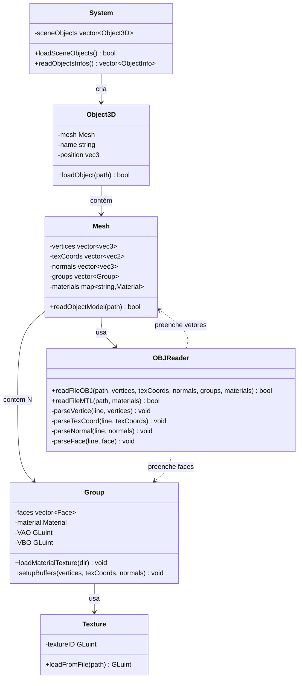
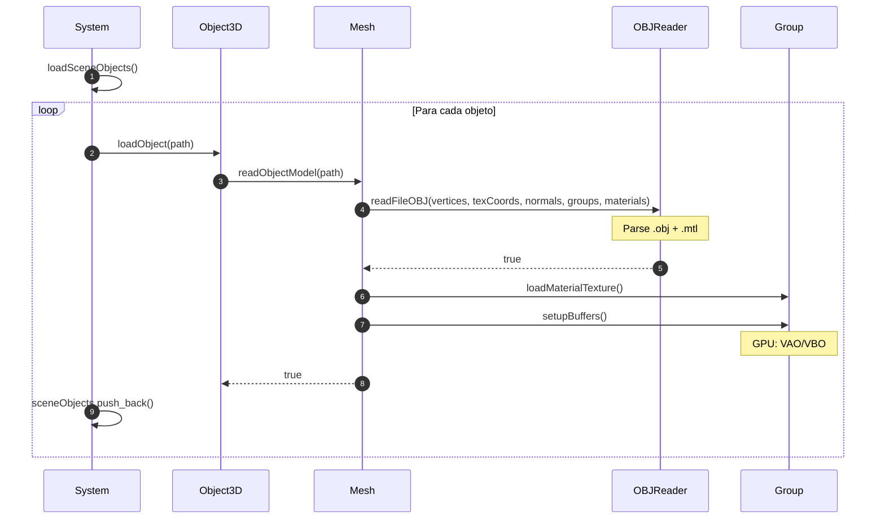

# Fluxo de Leitura de Arquivo OBJ

**System → Object3D → Mesh → OBJReader → Group → GPU** | Visualizador 3D - OpenGL 4.6

---

## Diagrama de Classes

---

## Sequência de Chamadas

---

## Métodos Principais

| Classe | Métodos Chave |
|--------|---------------|
| **System** | `loadSceneObjects()` `readObjectsInfos()` |
| **Object3D** | `loadObject(path)` |
| **Mesh** | `readObjectModel(path)` |
| **OBJReader** | `readFileOBJ(...)` `readFileMTL(...)` `parseVertice()` `parseTexCoord()` `parseNormal()` `parseFace()` |
| **Group** | `loadMaterialTexture(dir)` `setupBuffers(vertices, texCoords, normals)` |
| **Texture** | `loadFromFile(path)` |

### Estrutura de Dados

**CPU:** System → vector\<Object3D\> → Mesh (vertices, texCoords, normals) → vector\<Group\> (faces, material)  
**GPU:** Group (VAO, VBO) + Material (textureID)

---

## Fluxo Resumido

---

**Autores:** Ian Rossetti Boniatti e Eduardo Tropea  
**Curso:** Jogos Digitais - Unisinos  
**Disciplina:** Computação Gráfica em Tempo Real  
**Data:** Novembro 2025
