# 📊 Fluxo Visual: Leitura de Arquivo OBJ

> **Diagrama de Classes e Métodos** - Fluxo simplificado desde System até GPU

---

## 🔄 Diagrama de Fluxo Principal


---

## 📦 Diagrama de Classes e Métodos

```mermaid
classDiagram
    class System {
        +loadSceneObjects() bool
        +readObjectsInfos() vector~ObjectInfo~
        -sceneObjects vector~Object3D~
    }
    
    class Object3D {
        +loadObject(path) bool
        -mesh Mesh
        -name string
        -position vec3
    }
    
    class Mesh {
        +readObjectModel(path) bool
        -vertices vector~vec3~
        -texCoords vector~vec2~
        -normals vector~vec3~
        -groups vector~Group~
        -materials map~string,Material~
    }
    
    class OBJReader {
        +readFileOBJ(path, vertices, texCoords, normals, groups, materials) bool
        +readFileMTL(path, materials) bool
        -parseVertice(line, vertices) void
        -parseTexCoord(line, texCoords) void
        -parseNormal(line, normals) void
        -parseFace(line, face) void
    }
    
    class Group {
        +loadMaterialTexture(dir) void
        +setupBuffers(vertices, texCoords, normals) void
        -faces vector~Face~
        -material Material
        -VAO GLuint
        -VBO GLuint
    }
    
    class Texture {
        +loadFromFile(path) GLuint
        -textureID GLuint
    }
    
    System --> Object3D : cria
    Object3D --> Mesh : contém
    Mesh --> OBJReader : usa
    Mesh --> Group : contém N
    Group --> Texture : usa
    OBJReader ..> Mesh : preenche vetores
    OBJReader ..> Group : preenche faces
```



---

## 🔀 Sequência de Chamadas

```mermaid
sequenceDiagram
    autonumber
    
    box Sistema
    participant Sys as System
    end
    
    box Objeto
    participant Obj as Object3D
    participant Msh as Mesh
    end
    
    box Parser
    participant OBJ as OBJReader
    end
    
    box Renderização
    participant Grp as Group
    participant Tex as Texture
    end
    
    Sys->>Sys: loadSceneObjects()
    Sys->>Sys: readObjectsInfos()
    
    loop Para cada objeto
        Sys->>Obj: new Object3D(name)
        Sys->>Obj: loadObject(path)
        Obj->>Msh: readObjectModel(path)
        Msh->>OBJ: readFileOBJ(...)
        
        OBJ->>OBJ: readFileMTL(...)
        OBJ->>OBJ: parseVertice(...)
        OBJ->>OBJ: parseTexCoord(...)
        OBJ->>OBJ: parseNormal(...)
        OBJ->>OBJ: parseFace(...)
        
        OBJ-->>Msh: true
        
        Msh->>Grp: loadMaterialTexture(dir)
        Grp->>Tex: loadFromFile(path)
        Tex-->>Grp: textureID
        
        Msh->>Grp: setupBuffers(...)
        Note over Grp: Envia para GPU
        
        Msh-->>Obj: true
        Obj-->>Sys: true
        
        Sys->>Sys: sceneObjects.push_back()
    end
```



---

## 📁 Estrutura de Dados


---

## 🎯 Métodos Principais por Classe

### System

```cpp
bool loadSceneObjects()
vector<ObjectInfo> readObjectsInfos()
```

### Object3D

```cpp
bool loadObject(string& path)
```

### Mesh

```cpp
bool readObjectModel(string& objFilePath)
```

### OBJReader

```cpp
static bool readFileOBJ(const string& objFilePath,
                        vector<vec3>& vertices,
                        vector<vec2>& texCoords,
                        vector<vec3>& normals,
                        vector<Group>& groups,
                        map<string, Material>& materials)

static bool readFileMTL(const string& mtlFilePath,
                        map<string, Material>& materials)

static void parseVertice(const string& line, vector<vec3>& vertices)
static void parseTexCoord(const string& line, vector<vec2>& texCoords)
static void parseNormal(const string& line, vector<vec3>& normals)
static void parseFace(const string& line, Face& face)
```

### Group

```cpp
void loadMaterialTexture(const string& modelDirectory)
void setupBuffers(const vector<vec3>& vertices,
                  const vector<vec2>& texCoords,
                  const vector<vec3>& normals)
```

### Texture

```cpp
static GLuint loadFromFile(const string& path)
```

---

## 📋 Fluxo Simplificado


---

**Autores:** Ian Rossetti Boniatti e Eduardo Tropea  
**Curso:** Jogos Digitais - Unisinos  
**Disciplina:** Computação Gráfica em Tempo Real  
**Data:** Novembro 2025
