# 🔄 Fluxo de Dados - Visualizador 3D

## Detalhamento Completo do Fluxo de Informações

> 📘 **Documentação Técnica:** Este documento detalha como os dados fluem através do sistema, desde o disco até a tela, incluindo todas as transformações e transferências entre CPU e GPU.

---

## 📋 Índice

1. [🌐 Visão Geral do Fluxo de Dados](#-visão-geral-do-fluxo-de-dados)
2. [⚙️ Fluxo de Dados: Inicialização](#️-fluxo-de-dados-inicialização)
3. [🔁 Fluxo de Dados: Loop de Renderização](#fluxo-de-dados-loop-de-renderização)
4. [🎨 Fluxo de Dados: Pipeline OpenGL](#fluxo-de-dados-pipeline-opengl)
5. [📦 Estruturas de Dados](#estruturas-de-dados)
6. [💾 Mapeamento de Memória](#mapeamento-de-memória)

---

## 🌐 Visão Geral do Fluxo de Dados

> **Objetivo:** Compreender como os dados transitam entre Disco → RAM → VRAM → Tela

### Arquitetura de Dados do Sistema

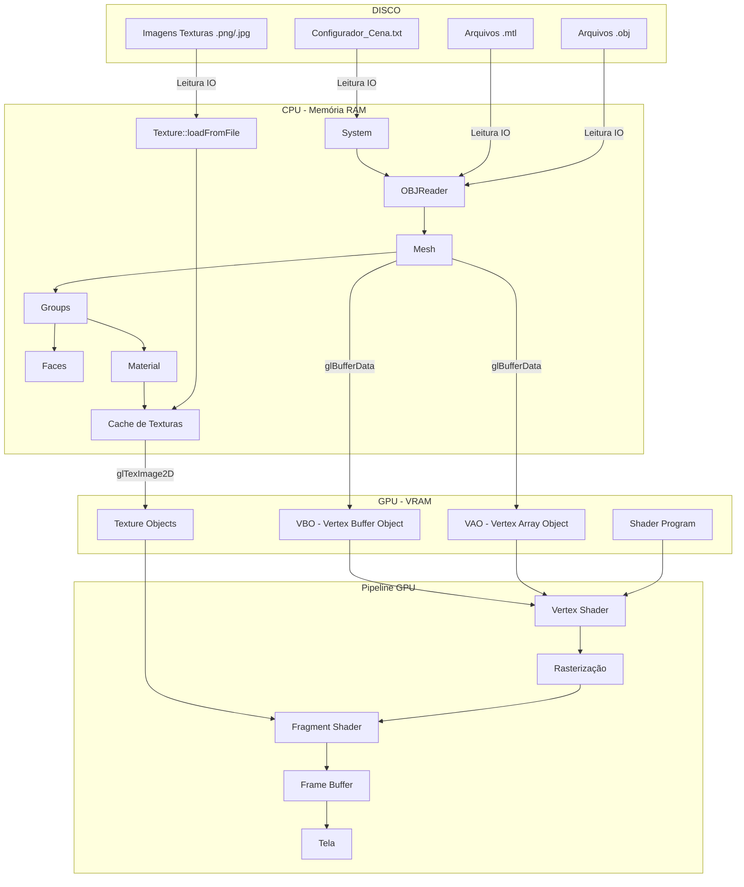

---

## ⚙️ Fluxo de Dados: Inicialização

> **Fase:** Carregamento inicial de todos os recursos antes do loop principal

### 📄 1. Leitura de Configuração da Cena

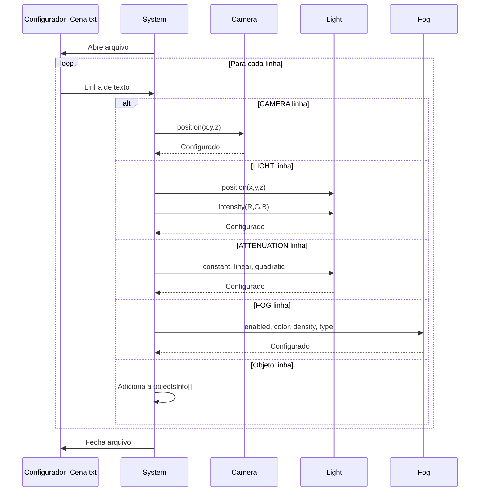

**Formato dos Dados no Arquivo:**

```ini
# ========================================
# Configuração do Sistema
# ========================================
CAMERA 0.0 2.0 20.0                    # Posição inicial (x, y, z)
LIGHT 0.0 10.0 5.0 1.0 1.0 1.0         # Posição + Intensidade RGB
ATTENUATION 1.0 0.045 0.0075           # Constantes k_c, k_l, k_q
FOG 1 0.9 0.9 0.9 0.05 10.0 50.0 1    # Enabled + Color + Densidade + Tipo

# ========================================
# Objetos da Cena
# ========================================
# Nome  Modelo              Pos(x,y,z)      Rot(x,y,z)    Escala       Elim
Pista   models/pista.obj    0.0 -0.5 0.0    0.0 0.0 0.0   1.0 1.0 1.0  0
Carro   models/car.obj      0.0 0.0 0.0     0.0 90.0 0.0  1.0 1.0 1.0  1
```

**Estrutura ObjectInfo (CPU):**

```cpp
struct ObjectInfo {
    string name;        // "Carro"
    string modelPath;   // "models/car.obj"
    vec3 position;      // (0.0, 0.0, 0.0)
    vec3 rotation;      // (0.0, 90.0, 0.0)
    vec3 scale;         // (1.0, 1.0, 1.0)
    bool eliminable;    // true
};
```

---

### 2. Carregamento de Modelo OBJ → GPU

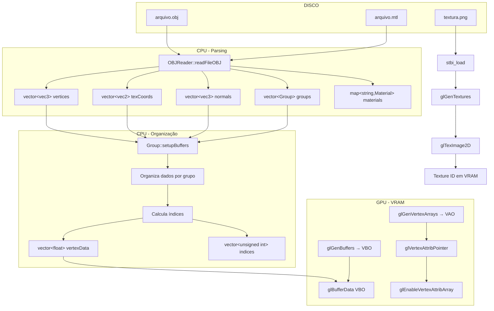

---

### 3. Estrutura de Dados: Arquivo OBJ → Mesh

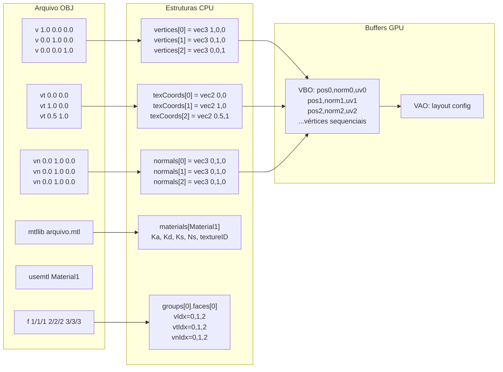

---

### 4. Layout de Vértice Completo (VBO)

```text
┌─────────────────────────────────────────────────────────┐
│                    VBO (GPU VRAM)                       │
│              FORMATO INTERLEAVED (Entrelaçado)          │
├─────────────────────────────────────────────────────────┤
│ Vértice 0:                                              │
│   layout(location=0): vec3 position    (12 bytes)      │
│   layout(location=1): vec2 texCoord    (8 bytes)       │
│   layout(location=2): vec3 normal      (12 bytes)      │
│   TOTAL: 32 bytes (8 floats)                           │
├─────────────────────────────────────────────────────────┤
│ Vértice 1:                                              │
│   layout(location=0): vec3 position    (12 bytes)      │
│   layout(location=1): vec2 texCoord    (8 bytes)       │
│   layout(location=2): vec3 normal      (12 bytes)      │
│   TOTAL: 32 bytes (8 floats)                           │
├─────────────────────────────────────────────────────────┤
│ ...                                                     │
│ Vértice N:                                              │
│   (mesmo layout, dados sequenciais)                    │
└─────────────────────────────────────────────────────────┘

⚠️ NOTA: Não usa EBO - vértices são armazenados sequencialmente
         Triângulos compartilham vértices duplicados no VBO
         Usa glDrawArrays ao invés de glDrawElements
```

**Código de Setup (Group::setupBuffers):**

```cpp
// Stride: 32 bytes (3 floats pos + 2 floats texCoord + 3 floats normal)
GLsizei stride = 8 * sizeof(float);

// Location 0: Posição (offset 0)
glVertexAttribPointer(0, 3, GL_FLOAT, GL_FALSE, stride, (void*)0);
glEnableVertexAttribArray(0);

// Location 1: TexCoord (offset 12 bytes = 3 floats)
glVertexAttribPointer(1, 2, GL_FLOAT, GL_FALSE, stride, (void*)(3 * sizeof(float)));
glEnableVertexAttribArray(1);

// Location 2: Normal (offset 20 bytes = 5 floats)
glVertexAttribPointer(2, 3, GL_FLOAT, GL_FALSE, stride, (void*)(5 * sizeof(float)));
glEnableVertexAttribArray(2);

// Renderização usa glDrawArrays, não glDrawElements
glDrawArrays(GL_TRIANGLES, 0, vertexCount);
```

---

## Fluxo de Dados: Loop de Renderização

### 1. Ciclo de Atualização e Renderização

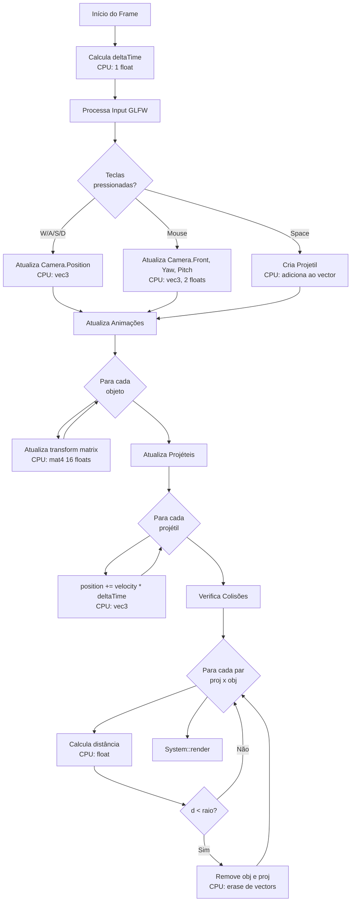

---

### 2. Fluxo Detalhado de Renderização

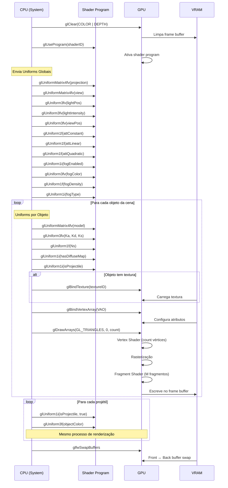

---

### 3. Dados Enviados como Uniforms (CPU → GPU)

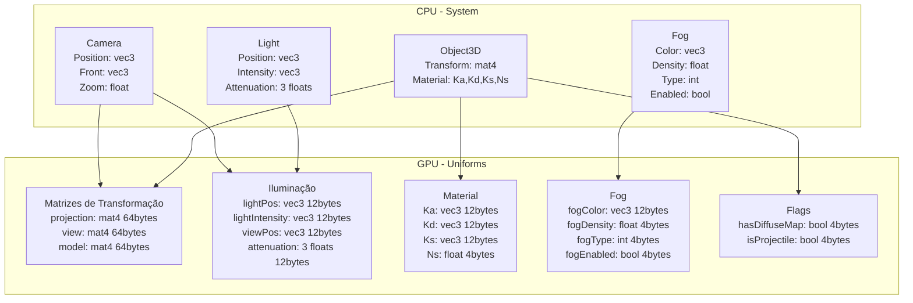

**Tamanho Total de Uniforms por Frame:**

| Categoria | Dados | Tamanho |
|-----------|-------|---------|
| **Matrizes** | projection, view | 128 bytes (enviado 1x/frame) |
| **Iluminação Global** | light, attenuation, viewPos | 48 bytes (enviado 1x/frame) |
| **Fog** | color, density, type, enabled | 32 bytes (enviado 1x/frame) |
| **Por Objeto** | model, material | 112 bytes (enviado N vezes) |
| **Por Objeto** | flags, color | 16 bytes (enviado N vezes) |

Para uma cena com 20 objetos:

- Uniforms globais: ~200 bytes
- Uniforms por objeto: 128 × 20 = 2,560 bytes
- **Total: ~2.8 KB enviados CPU→GPU por frame**

---

## Fluxo de Dados: Pipeline OpenGL

### 1. Vertex Shader - Transformação de Vértices

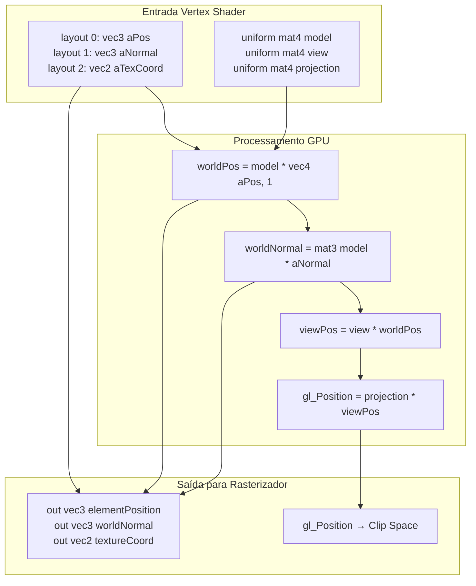

**Exemplo de Transformação:**

```text
Vértice Original (Object Space):
  aPos = (1.0, 0.0, 0.0)

Aplicando Transformações:
  1. Model:      (1,0,0) → (2,0,0)     [scale 2x]
  2. View:       (2,0,0) → (0,0,-18)   [câmera em z=20]
  3. Projection: (0,0,-18) → NDC       [perspectiva]
  
gl_Position = (-0.5, 0.0, 0.9, 1.0)  [Normalized Device Coords]
```

---

### 2. Rasterização - Vértices → Fragmentos

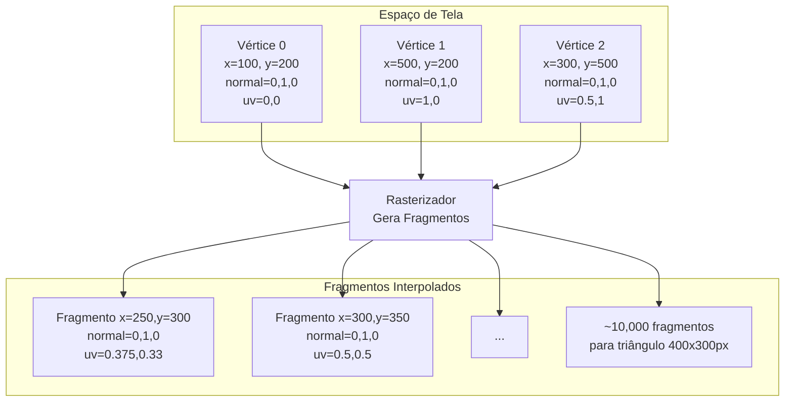

**Interpolação Linear:**

```text
Para fragmento em (x, y):
  - Calcula coordenadas baricêntricas (u, v, w)
  - Interpola atributos:
    normal_frag = u*normal0 + v*normal1 + w*normal2
    uv_frag = u*uv0 + v*uv1 + w*uv2
```

---

### 3. Fragment Shader - Cálculo de Iluminação Phong

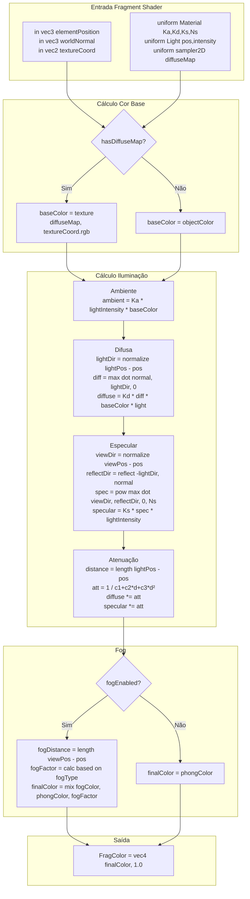

**Exemplo de Cálculo por Fragmento:**

```text
Entrada:
  elementPosition = (5.0, 2.0, -10.0)
  worldNormal = (0.0, 1.0, 0.0)
  textureCoord = (0.5, 0.5)
  
Textura:
  baseColor = texture(diffuseMap, uv) = (0.8, 0.2, 0.1)
  
Ambiente:
  ambient = (0.1,0.1,0.1) * (1,1,1) * (0.8,0.2,0.1) = (0.08,0.02,0.01)
  
Difusa:
  lightDir = normalize((0,10,5) - (5,2,-10)) = normalize(-5,8,15) = (-0.28,0.45,0.85)
  diff = max(dot((0,1,0), (-0.28,0.45,0.85)), 0) = 0.45
  diffuse = (0.8,0.8,0.8) * 0.45 * (1,1,1) * (0.8,0.2,0.1) = (0.29,0.07,0.04)
  
Especular:
  viewDir = normalize((0,2,20) - (5,2,-10)) = normalize(-5,0,30) = (-0.16,0,0.99)
  reflectDir = reflect((0.28,-0.45,-0.85), (0,1,0)) = (0.28,0.45,-0.85)
  spec = pow(max(dot((-0.16,0,0.99), (0.28,0.45,-0.85)), 0), 32) = pow(0, 32) = 0
  specular = (0, 0, 0)
  
Atenuação:
  distance = length((0,10,5) - (5,2,-10)) = 17.35
  att = 1 / (1 + 0.045*17.35 + 0.0075*17.35²) = 0.38
  diffuse *= 0.38 = (0.11, 0.03, 0.02)
  
Phong Total:
  phongColor = (0.08,0.02,0.01) + (0.11,0.03,0.02) + (0,0,0) = (0.19, 0.05, 0.03)
  
Fog (se enabled):
  fogDistance = 30.4
  fogFactor = exp(-0.05 * 30.4) = 0.22
  finalColor = mix((0.9,0.9,0.9), (0.19,0.05,0.03), 0.22) = (0.74, 0.72, 0.71)
  
Saída:
  FragColor = (0.74, 0.72, 0.71, 1.0)
```

---

### 4. Depth Test e Blending

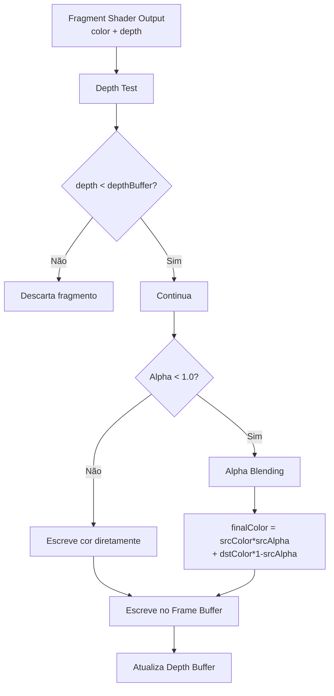

**Exemplo de Blending:**

```text
Fragmento Atual (vidro transparente):
  srcColor = (0.2, 0.3, 0.9, 0.3)  [30% opaco]
  
Frame Buffer (já renderizado):
  dstColor = (0.8, 0.1, 0.1, 1.0)  [vermelho]
  
Blending:
  finalColor.rgb = (0.2,0.3,0.9)*0.3 + (0.8,0.1,0.1)*(1-0.3)
                 = (0.06,0.09,0.27) + (0.56,0.07,0.07)
                 = (0.62, 0.16, 0.34)  [azulado sobre vermelho]
```

---

## Estruturas de Dados

### 1. Hierarquia de Classes e Dados

```text
System
├── Camera
│   ├── vec3 Position         [12 bytes]
│   ├── vec3 Front            [12 bytes]
│   ├── vec3 Up               [12 bytes]
│   ├── vec3 Right            [12 bytes]
│   ├── float Yaw, Pitch      [8 bytes]
│   └── float Zoom            [4 bytes]
│   TOTAL: ~60 bytes
│
├── Shader
│   ├── GLuint ID             [4 bytes]
│   └── string vertexSource   [variável]
│   └── string fragmentSource [variável]
│
├── vector<unique_ptr<Object3D>>
│   └── Object3D
│       ├── string name               [~50 bytes]
│       ├── vec3 position             [12 bytes]
│       ├── vec3 rotation             [12 bytes]
│       ├── vec3 scale                [12 bytes]
│       ├── mat4 transform            [64 bytes]
│       ├── bool eliminable           [1 byte]
│       └── Mesh
│           ├── vector<vec3> vertices     [N * 12 bytes]
│           ├── vector<vec2> texCoords    [N * 8 bytes]
│           ├── vector<vec3> normals      [N * 12 bytes]
│           ├── vector<Group> groups
│           │   └── Group
│           │       ├── string name           [~30 bytes]
│           │       ├── vector<Face> faces    [M faces]
│           │       ├── Material material
│           │       │   ├── vec3 Ka, Kd, Ks   [36 bytes]
│           │       │   ├── float Ns, alpha   [8 bytes]
│           │       │   └── GLuint textureID  [4 bytes]
│           │       ├── GLuint VAO            [4 bytes]
│           │       ├── GLuint VBO            [4 bytes]
│           │       ├── int vertexCount       [4 bytes]
│           │       └── vector<float> vertices [N * 32 bytes]
│           └── BoundingBox
│               ├── vec3 pontoMinimo      [12 bytes]
│               └── vec3 pontoMaximo      [12 bytes]
│
└── vector<unique_ptr<Projetil>>
    └── Projetil : Object3D
        ├── vec3 velocity         [12 bytes]
        ├── float speed           [4 bytes]
        └── bool active           [1 byte]
```

---

### 2. Exemplo de Ocupação de Memória

**Objeto Simples (Cubo):**

```text
Cubo com 36 vértices (6 faces × 2 triângulos × 3 vértices):
  vertices:   36 × 12 bytes = 432 bytes
  texCoords:  36 × 8 bytes  = 288 bytes
  normals:    36 × 12 bytes = 432 bytes
  faces:      12 × ~40 bytes = 480 bytes  [6 faces × 2 triângulos]
  Material:   ~100 bytes
  Buffers:    8 bytes (VAO, VBO IDs)
  
  TOTAL CPU: ~1.8 KB
  
  GPU (VBO): 36 × 32 bytes = 1,152 bytes (dados interleaved)
  GPU (Textura 512×512 RGB): 786 KB
  
  TOTAL GPU: ~787 KB
  
⚠️ NOTA: Vértices duplicados (sem EBO) = maior uso de VRAM
         Vantagem: Melhor cache locality e simplicidade
```

**Cena Completa (20 objetos):**

```text
CPU:
  System overhead:        ~1 KB
  Camera:                 ~100 bytes
  20 objetos × 5 KB:      100 KB
  Cache de 10 texturas:   ~1 KB (apenas IDs)
  
  TOTAL CPU: ~100 KB

GPU (VRAM):
  20 objetos × 1 MB:      20 MB (geometria)
  10 texturas × 1 MB:     10 MB
  Frame buffers:          6 MB (1024×768×4 bytes × 2 buffers)
  Depth buffer:           3 MB
  Shader programs:        ~100 KB
  
  TOTAL GPU: ~39 MB
```

---

## Mapeamento de Memória

### 1. Fluxo Disco → RAM → VRAM

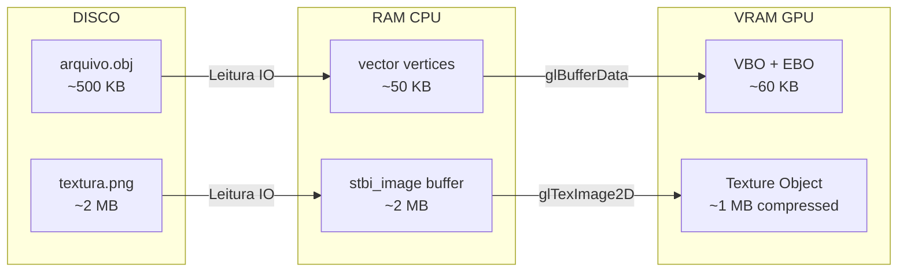

---

### 2. Timeline de Transferência de Dados

```mermaid
gantt
    title Carregamento de Objeto 3D
    dateFormat X
    axisFormat %L ms
    
    section Disco→CPU
    Abre arquivo .obj           :0, 5
    Parse vértices              :5, 30
    Parse faces                 :35, 20
    Carrega .mtl                :55, 10
    Carrega imagem PNG          :65, 50
    
    section CPU→GPU
    glGenBuffers                :115, 1
    glBufferData VBO            :116, 5
    glBufferData EBO            :121, 2
    glVertexAttribPointer       :123, 1
    glGenTextures               :124, 1
    glTexImage2D                :125, 15
    
    section Total
    Tempo total                 :0, 140
```

**Tempos Típicos:**

- Leitura de .obj (500 KB): ~30 ms
- Parse de geometria: ~20 ms
- Carregamento de textura PNG: ~50 ms
- Upload para GPU: ~20 ms
- **Total por objeto: ~120 ms**

Para 20 objetos (sem otimização): **~2.4 segundos**

---

### 3. Otimizações de Transferência

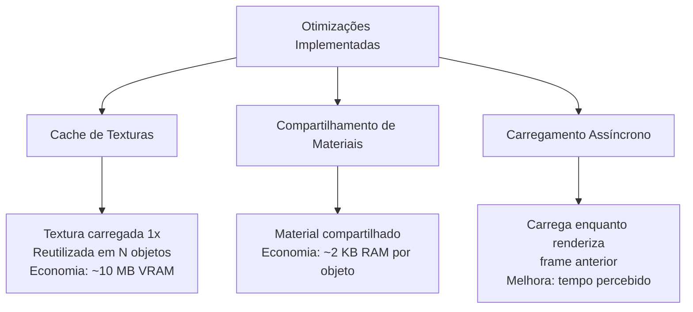

---

## Resumo de Performance

### Dados Transferidos por Frame (60 FPS)

| Tipo de Dado | Quantidade | Tamanho | Frequência |
|--------------|------------|---------|------------|
| **Uniforms** | ~30 uniforms | ~3 KB | 60x/s = 180 KB/s |
| **Comandos Draw** | ~20 draws | ~1 KB | 60x/s = 60 KB/s |
| **Frame Buffer** | 1024×768×4 | 3 MB | 60x/s = 180 MB/s |
| **Texture Fetch** | Variável | - | Dentro da GPU (VRAM) |
| **Vertex Fetch** | Variável | - | Dentro da GPU (VRAM) |

**Bandwidth CPU→GPU:** ~250 KB/s  
**Bandwidth Interno GPU:** ~10 GB/s (texture/vertex fetches)  
**Bandwidth GPU→Monitor:** ~180 MB/s (frame buffer)

---

### Gargalos Comuns

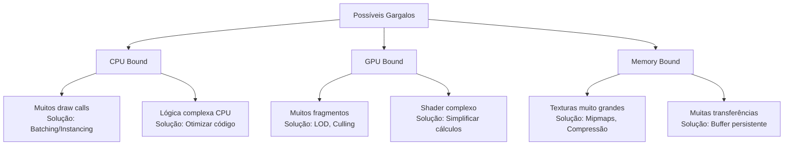

---

**Autores:** Ian Rossetti Boniatti e Eduardo Tropea  
**Curso:** Jogos Digitais - Unisinos  
**Disciplina:** Computação Gráfica em Tempo Real  
**Data:** Novembro 2025
